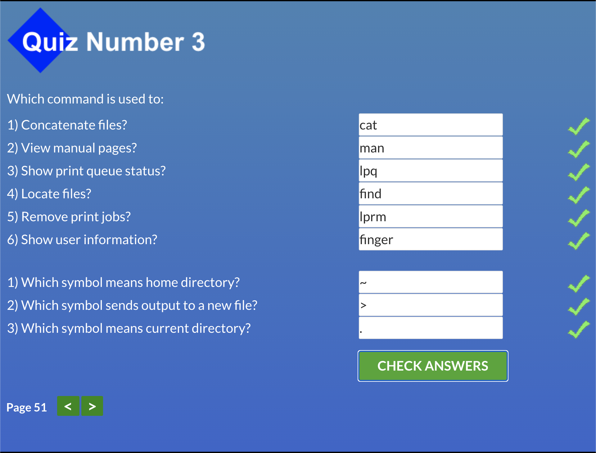
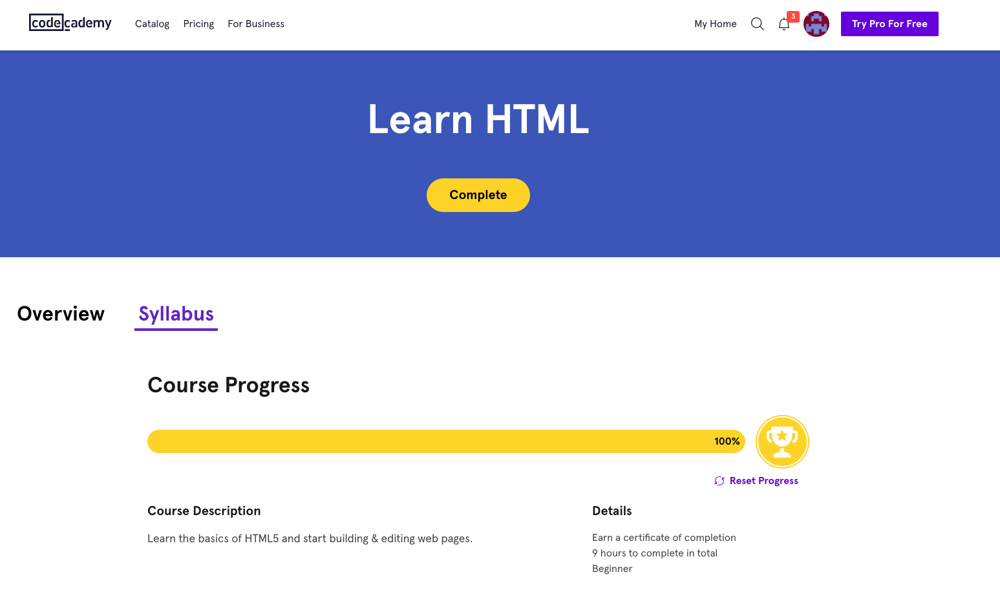

# kottans-frontend

## Stage 0. Self-Study

#### General

- [x] [GIT Basics](https://github.com/kottans/frontend/blob/master/tasks/git-intro.md)
- [x] [Linux CLI and Networking](https://github.com/kottans/frontend/blob/master/tasks/linux-cli-http.md)
- [x] [VCS (hello gitty), GitHub and Collaboration](https://github.com/kottans/frontend/blob/master/tasks/git-collaboration.md)

#### Front-End Basics

- [x] [Intro to HTML & CSS](https://github.com/kottans/frontend/blob/master/tasks/html-css-intro.md)
- [x] [Responsive Web Design](https://github.com/kottans/frontend/blob/master/tasks/html-css-responsive.md)
- [x] [HTML & CSS Practice](https://github.com/kottans/frontend/blob/master/tasks/htm=[l-css-popup.md)
- [x] [JavaScript Basics](https://github.com/kottans/frontend/blob/master/tasks/js-basics.md)
- [x] [Document Object Model](https://github.com/kottans/frontend/blob/master/tasks/js-dom.md) - practice

#### Advanced Topics

- [x] [Building a Tiny JS World (pre-OOP)](https://github.com/kottans/frontend/blob/master/tasks/js-pre-oop.md) - practice
- [x] [Object oriented JS](https://github.com/kottans/frontend/blob/master/tasks/js-oop.md) - practice
- [x] [OOP exercise](https://github.com/kottans/frontend/blob/master/tasks/js-post-oop.md) - practice
- [ ] [Offline Web Applications](https://github.com/kottans/frontend/blob/master/tasks/app-design-offline.md)
- [x] [Memory pair game](https://github.com/kottans/frontend/blob/master/tasks/memory-pair-game.md) — real project!
- [ ] [Website Performance Optimization](https://github.com/kottans/frontend/blob/master/tasks/app-design-performance.md)
- [x] [Friends App](https://github.com/kottans/frontend/blob/master/tasks/friends-app.md) - real project!

### My progress

#### 1. GIT Basics

    
Version Control with Git

    
Main 

 

    
Remote

  

#### 2. Linux CLI and Networking

    
Screenshots

  

 

 
 

**Http articles review:**
For the first article I was already familiar with HTTP basics, it was good to repeat material. But it was also good to have some practical examples in web frameworks and libraries. The second article was more interesting to me as it includes a more deep knowledge of HTTP such as connection handling, identification and authentication and caching.

#### 3. VCS (hello gitty), GitHub and Collaboration

    
Screenshots

  

#### 4. Intro to HTML and CSS

    
Screenshots

  

[Codeacademy profile](https://www.codecademy.com/profiles/webRunner72606)  
[Learning material](learning_material/html_css)

#### 5. Responsive Web Design

    
Screenshots

  

[Learning material](learning_material/responsive_web_design)

#### 6. HTML & CSS Practice
[Demo](https://serhiiyakovenko.github.io/simple_html-css_popup/)  |  [Code](https://github.com/SerhiiYakovenko/simple_html-css_popup)

#### 7. JavaScript Basics

    
Screenshots

  

[freeCodeCamp profile material](https://www.freecodecamp.org/maxxtro)

#### 8. Document Object Model - practice

    
Screenshots

  

[JS-Dom Demo](https://serhiiyakovenko.github.io/js-dom/)  
[JS-Dom Code](https://github.com/SerhiiYakovenko/js-dom)

#### 9. Building a Tiny JS World (pre-OOP) - practice

[Tiny JS World Demo](https://serhiiyakovenko.github.io/a-tiny-JS-world/)  
[Tiny JS World Code](https://github.com/SerhiiYakovenko/a-tiny-JS-world/tree/serhiiyakovenko-tiny-JS-world)

#### 10. Object-Oriented JavaScript - practice

    
Screenshots

  

[Codewars profile](https://www.codewars.com/users/Maxxtro)  
[Frogger Demo](https://serhiiyakovenko.github.io/frontend-nanodegree-arcade-game/)  
[Frogger Code](https://github.com/SerhiiYakovenko/frontend-nanodegree-arcade-game/)

#### 11. Building a Tiny JS World (post-OOP) - practice

[JS Post OOP Demo](https://serhiiyakovenko.github.io/a-tiny-JS-world/)  
[JS Post OOP Code](https://github.com/SerhiiYakovenko/a-tiny-JS-world/tree/syakovenko-js-world-oop)

#### 12. Memory – Pair Game

[Memory – Pair Game Demo](https://serhiiyakovenko.github.io/memory-pair-game/)  
[Memory – Pair Game Code](https://github.com/SerhiiYakovenko/memory-pair-game)

#### 13. Friends App

[Friends App Demo](https://serhiiyakovenko.github.io/friends-app/)  
[Friends App Code](https://github.com/SerhiiYakovenko/friends-app/)