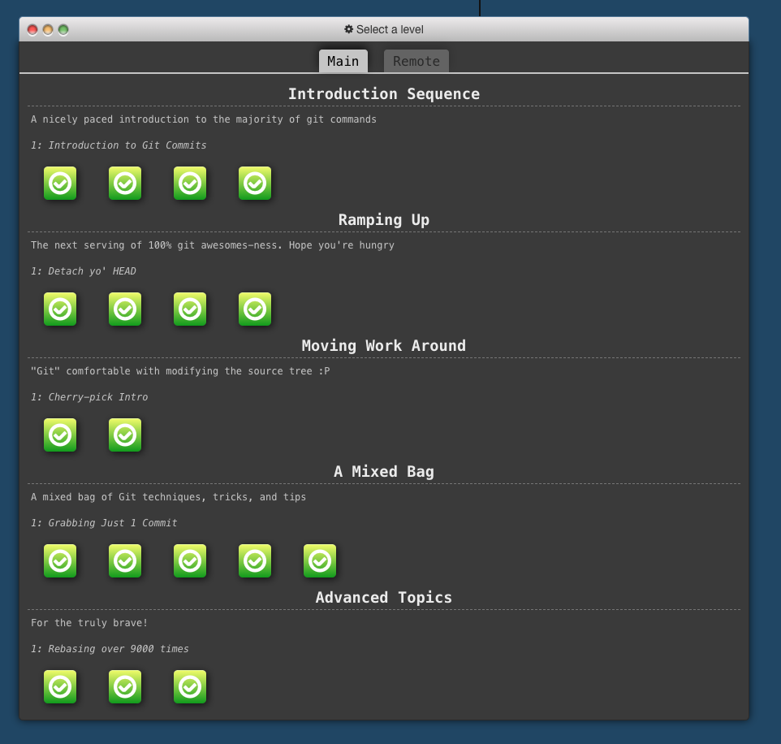
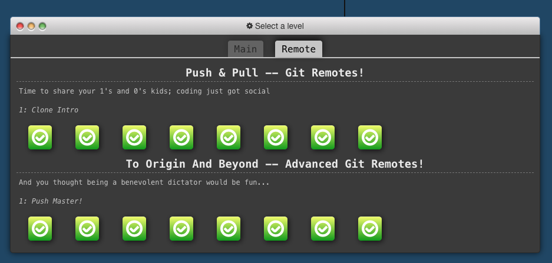
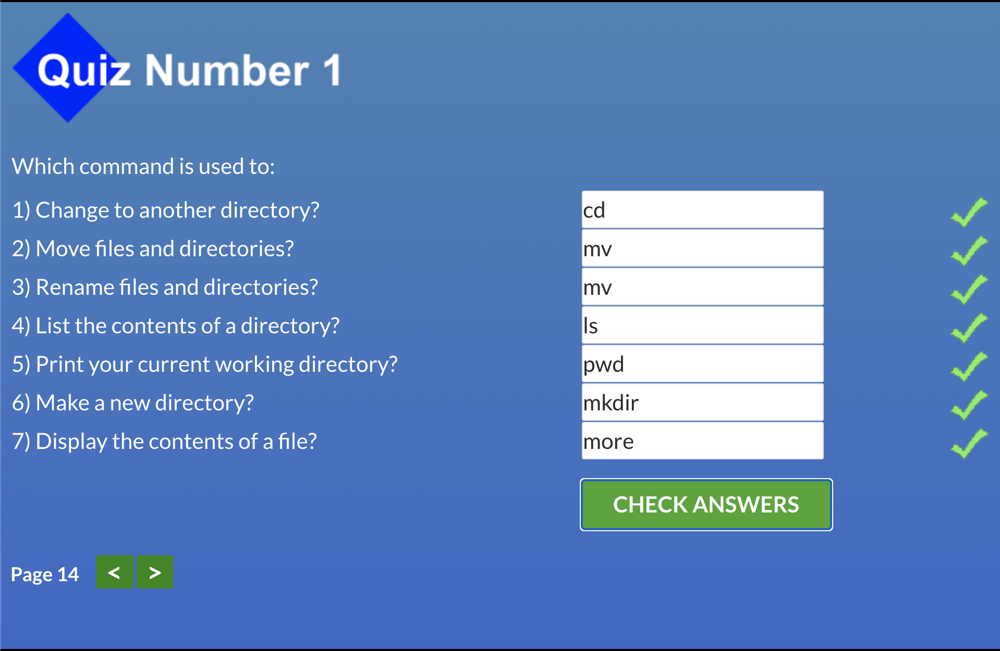
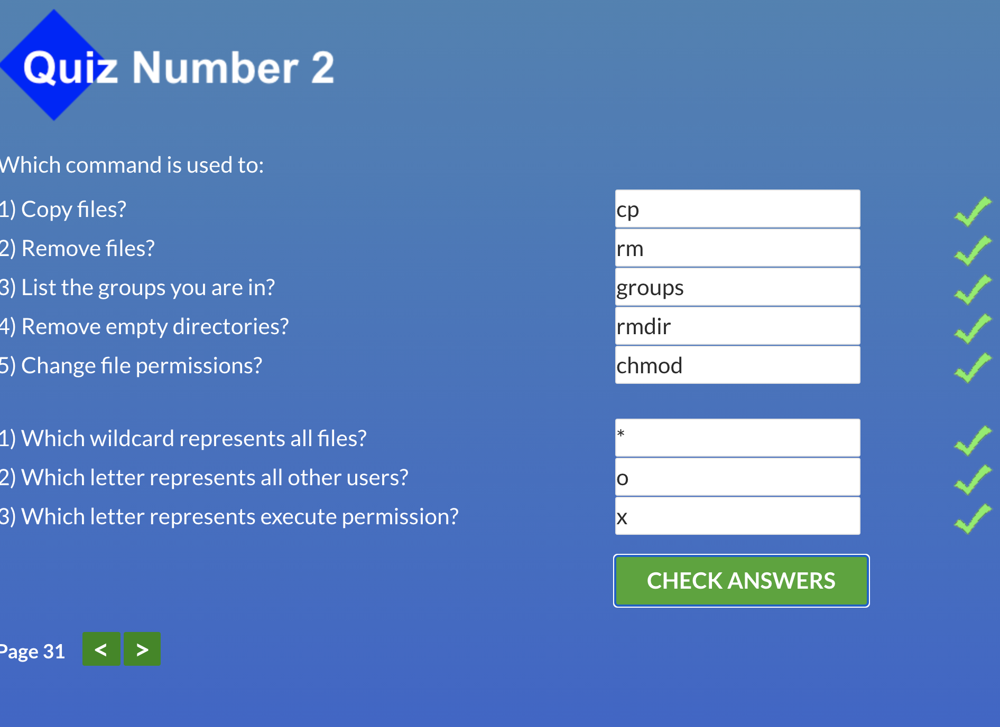
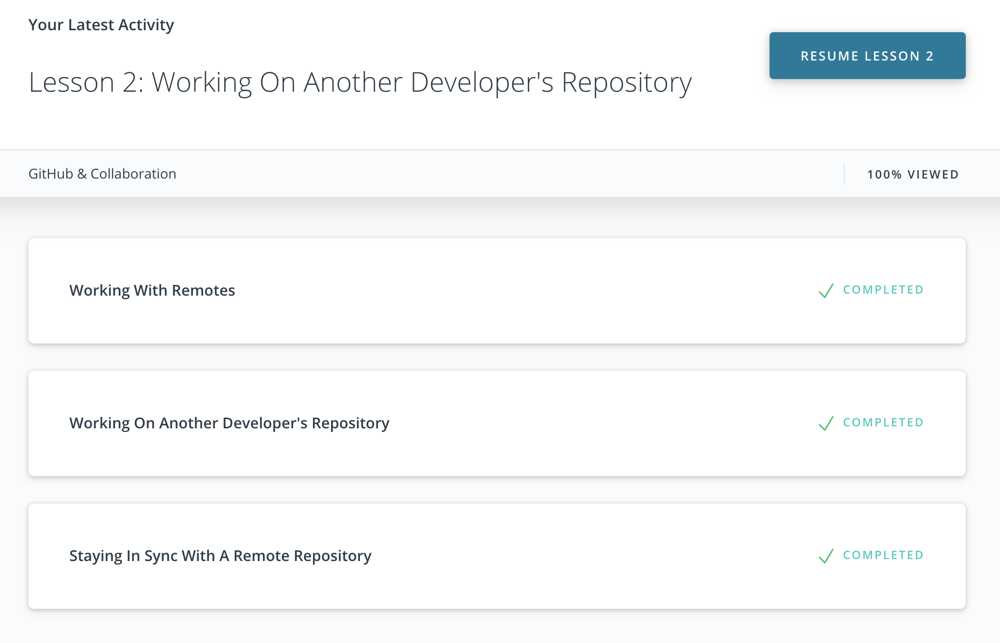

# kottans-frontend

## Stage 0. Self-Study

#### General

- [x] [GIT Basics](https://github.com/kottans/frontend/blob/master/tasks/git-intro.md)
- [x] [Linux CLI and Networking](https://github.com/kottans/frontend/blob/master/tasks/linux-cli-http.md)
- [x] [VCS (hello gitty), GitHub and Collaboration](https://github.com/kottans/frontend/blob/master/tasks/git-collaboration.md)

#### Front-End Basics

- [ ] [Intro to HTML & CSS](https://github.com/kottans/frontend/blob/master/tasks/html-css-intro.md)
- [ ] [Responsive Web Design](https://github.com/kottans/frontend/blob/master/tasks/html-css-responsive.md)
- [ ] [HTML & CSS Practice](https://github.com/kottans/frontend/blob/master/tasks/htm=[l-css-popup.md)
- [ ] [JavaScript Basics](https://github.com/kottans/frontend/blob/master/tasks/js-basics.md)
- [ ] [Document Object Model](https://github.com/kottans/frontend/blob/master/tasks/js-dom.md) - practice

#### Advanced Topics

- [ ] [Building a Tiny JS World (pre-OOP)](https://github.com/kottans/frontend/blob/master/tasks/js-pre-oop.md) - practice
- [ ] [Object oriented JS](https://github.com/kottans/frontend/blob/master/tasks/js-oop.md) - practice
- [ ] [OOP exercise](https://github.com/kottans/frontend/blob/master/tasks/js-post-oop.md) - practice
- [ ] [Offline Web Applications](https://github.com/kottans/frontend/blob/master/tasks/app-design-offline.md)
- [ ] [Memory pair game](https://github.com/kottans/frontend/blob/master/tasks/memory-pair-game.md) — real project!
- [ ] [Website Performance Optimization](https://github.com/kottans/frontend/blob/master/tasks/app-design-performance.md)
- [ ] [Friends App](https://github.com/kottans/frontend/blob/master/tasks/friends-app.md) - real project!

### My progress

#### 1. GIT Basics

    
Version Control with Git

    
Main 

 

    
Remote

  

#### 2. Linux CLI and Networking

    
Linux Survival (4 modules)

  

 

 
 

**Http articles review:**
For the first article I was already familiar with HTTP basics, it was good to repeat material. But it was also good to have some practical examples in web frameworks and libraries. Second article was more interesting to me as it includes a more deep knowledge of HTTP such as connection handling, identification and authentication and caching.

#### 3. VCS (hello gitty), GitHub and Collaboration

    
GitHub & Collaboration

  

