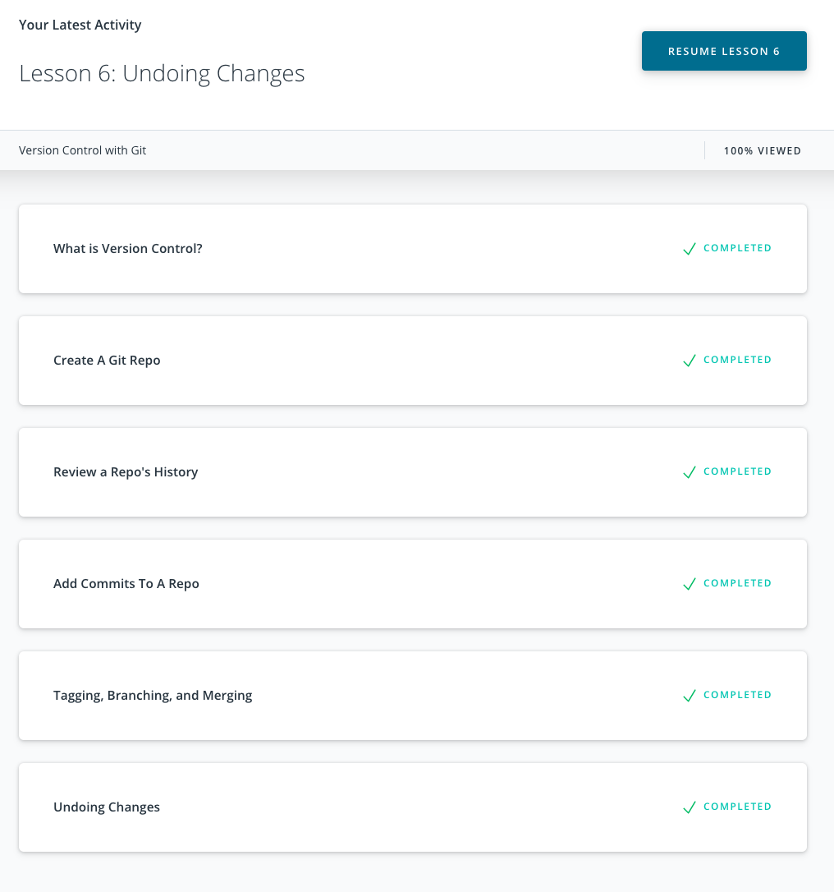

# kottans-frontend

## Stage 0. Self-Study

#### General

- [x] [GIT Basics](https://github.com/kottans/frontend/blob/master/tasks/git-intro.md)
- [ ] [Linux CLI and Networking](https://github.com/kottans/frontend/blob/master/tasks/linux-cli-http.md)
- [ ] [VCS (hello gitty), GitHub and Collaboration](https://github.com/kottans/frontend/blob/master/tasks/git-collaboration.md)

#### Front-End Basics

- [ ] [Intro to HTML & CSS](https://github.com/kottans/frontend/blob/master/tasks/html-css-intro.md)
- [ ] [Responsive Web Design](https://github.com/kottans/frontend/blob/master/tasks/html-css-responsive.md)
- [ ] [HTML & CSS Practice](https://github.com/kottans/frontend/blob/master/tasks/htm=[l-css-popup.md)
- [ ] [JavaScript Basics](https://github.com/kottans/frontend/blob/master/tasks/js-basics.md)
- [ ] [Document Object Model](https://github.com/kottans/frontend/blob/master/tasks/js-dom.md) - practice

#### Advanced Topics

- [ ] [Building a Tiny JS World (pre-OOP)](https://github.com/kottans/frontend/blob/master/tasks/js-pre-oop.md) - practice
- [ ] [Object oriented JS](https://github.com/kottans/frontend/blob/master/tasks/js-oop.md) - practice
- [ ] [OOP exercise](https://github.com/kottans/frontend/blob/master/tasks/js-post-oop.md) - practice
- [ ] [Offline Web Applications](https://github.com/kottans/frontend/blob/master/tasks/app-design-offline.md)
- [ ] [Memory pair game](https://github.com/kottans/frontend/blob/master/tasks/memory-pair-game.md) — real project!
- [ ] [Website Performance Optimization](https://github.com/kottans/frontend/blob/master/tasks/app-design-performance.md)
- [ ] [Friends App](https://github.com/kottans/frontend/blob/master/tasks/friends-app.md) - real project!

### My progress

#### 1. GIT Basics

Version Control with Git:

Main: 

Remote: 

#### 2. Linux CLI and Networking

Linux Survival (4 modules)

#### 3. VCS (hello gitty), GitHub and Collaboration

GitHub & Collaboration

Completed the following levels at learngitbranching.js.org:

Main: Ramping Up, Moving Work Around

Remote: To Origin and Beyond

