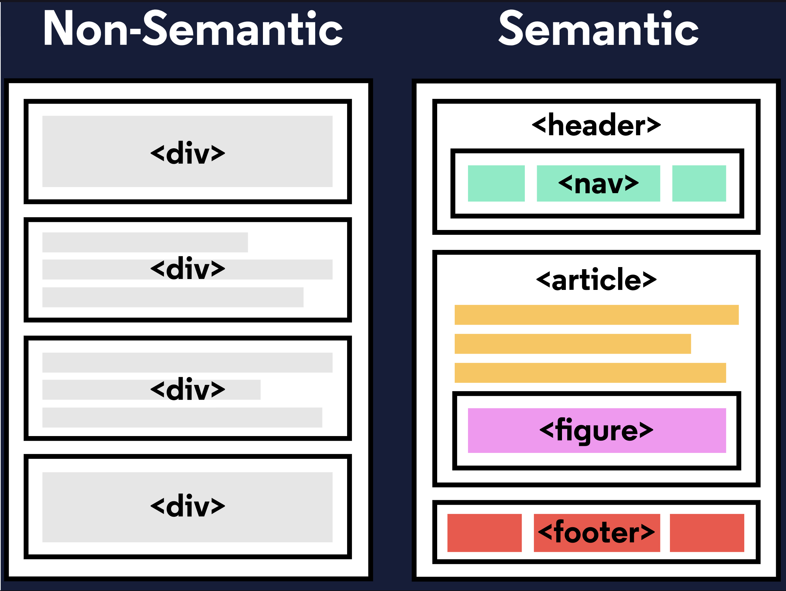
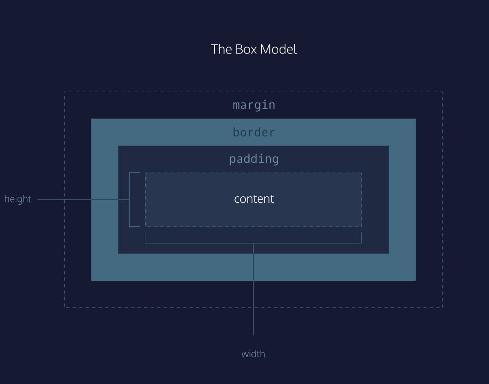

---
# HTML
---
##### General info
```
- HTML stands for HyperText Markup Language and is used to create the structure and content of a webpage.
- Most HTML elements contain opening and closing tags with raw text or other HTML tags between them.
- HTML elements can be nested inside other elements. The enclosed element is the child of the enclosing parent element.
- Any visible content should be placed within the opening and closing <body> tags.
- Headings and sub-headings, <h1> to <h6> tags, are used to enlarge text.
- <p>, <span> and <div> tags specify text or blocks.
- The <em> and <strong> tags are used to emphasize text.
- Line breaks are created with the <br> tag.
- Ordered lists (<ol>) are numbered and unordered lists (<ul>) are bulleted.
- Images () and videos (<video>) can be added by linking to an existing source.
```



##### Form/Input/List:
```
The purpose of a <form> is to allow users to input information and send it.
The <form>‘s action attribute determines where the form’s information goes.
The <form>‘s method attribute determines how the information is sent and processed.
To add fields for users to input information we use the <input> element and set the type attribute to a field of our choosing:
- Setting type to "text" creates a single row field for text input.
- Setting type to "password" creates a single row field that censors text input.
- Setting type to "number" creates a single row field for number input.
- Setting type to "range" creates a slider to select from a range of numbers.
- Setting type to "checkbox" creates a single checkbox which can be paired with other checkboxes.
- Setting type to "radio" creates a radio button that can be paired with other radio buttons.
- Setting type to "list" will pair the <input> with a <datalist> element if the id of both are the same.
- Setting type to "submit" creates a submit button.
A <select> element is populated with <option> elements and renders a dropdown list selection.
A <datalist> element is populated with <option> elements and works with an <input> to search through choices.
A <textarea> element is a text input field that has a customizable area.
When a <form> is submitted, the name of the fields that accept input and the value of those fields are sent as name=value pairs.
```
##### Form validation:
```
Adding the required attribute to an input related element will validate that the input field has information in it.
Assigning a value to the min attribute of a number input element will validate an acceptable minimum value.
Assigning a value to the max attribute of a number input element will validate an acceptable maximum value.
Assigning a value to the minlength attribute of a text input element will validate an acceptable minimum number of characters.
Assigning a value to the maxlength attribute of a text input element will validate an acceptable maximum number of characters.
Assigning a regex to pattern matches the input to the provided regex.
```
##### Semantic/Audio-Video
```
Semantic HTML introduces meaning to a page through specific elements that provide context as to what is in between the tags.
Semantic HTML is a modern standard and makes a website accessible for people who use screen readers to translate the webpage and improves your website’s SEO.
<header>, <nav> , <main> and <footer> create the basic structure of the webpage.
<section> defines elements in a document, such as chapters, headings, or any other area of the document with the same theme.
<article> holds content that makes sense on its own such as articles, blogs, comments, etc.
<aside> contains information that is related to the main content, but not required in order to understand the dominant information.
<figure> encapsulates all types of media.
<figcaption> is used to describe the media in <figure>.
<video>, <embed>, and <audio> elements are used for media files.
```
##### Cheatsheet:
https://www.codecademy.com/learn/learn-html/modules/learn-html-elements/cheatsheet
##### Link:
`<a href="https://www.udacity.com">Udacity</a>`
##### Image:
``
##### Comment:
`<!-- This is a comment -->`

---

# CSS
---

##### Review CSS Selectors
```
CSS can change the look of HTML elements. In order to do this, CSS must select HTML elements, then apply styles to them.
CSS can select HTML elements by tag, class, or ID.
Multiple CSS classes can be applied to one HTML element.
Classes can be reusable, while IDs can only be used once.
IDs are more specific than classes, and classes are more specific than tags. That means IDs will override any styles from a class, and classes will override any styles from a tag selector.
Multiple selectors can be chained together to select an element. This raises the specificity, but can be necessary.
Nested elements can be selected by separating selectors with a space.
Multiple unrelated selectors can receive the same styles by separating the selector names with commas.
```
##### Visual Rules
```
CSS declarations are structured into property and value pairs.
The font-family property defines the typeface of an element.
font-size controls the size of text displayed.
font-weight defines how thin or thick text is displayed.
The text-align property places text in the left, right, or center of its parent container.
Text can have two different color attributes: color and background-color. color defines the color of the text, while background-color defines the color behind the text.
CSS can make an element transparent with the opacity property.
CSS can also set the background of an element to an image with the background-image property.
The !important flag will override any style, however it should almost never be used, as it is extremely difficult to override.
```
##### The Box Model

```
The box model comprises the set of properties which define parts of an element that take up space on a web page. The model includes the content area’s size (width and height) and the element’s padding, border, and margin. The properties include:

Width and height — specifies the width and height of the content area.
Padding — specifies the amount of space between the content area and the border.
Border — specifies the thickness and style of the border surrounding the content area and padding.
Margin — specifies the amount of space between the border and the outside edge of the element.
```
##### Properties
```
The box model comprises a set of properties used to create space around and between HTML elements.
The height and width of a content area can be set in pixels or percentage.
Borders surround the content area and padding of an element. The color, style, and thickness of a border can be set with CSS properties.
Padding is the space between the content area and the border. It can be set in pixels or percent.
Margin is the amount of spacing outside of an element’s border.
Horizontal margins add, so the total space between the borders of adjacent elements is equal to the sum of the right margin of one element and the left margin of the adjacent element.
Vertical margins collapse, so the space between vertically adjacent elements is equal to the larger margin.
margin: 0 auto horizontally centers an element inside of its parent content area, if it has a width.
The overflow property can be set to display, hide, or scroll, and dictates how HTML will render content that overflows its parent’s content area.
The visibility property can hide or show elements.
```
##### Layout
```
The position property allows you to specify the position of an element in three different ways.
When set to relative, an element’s position is relative to its default position on the page.
When set to absolute, an element’s position is relative to its closest positioned parent element. It can be pinned to any part of the web page, but the element will still move with the rest of the document when the page is scrolled.
When set to fixed, an element’s position can be pinned to any part of the web page. The element will remain in view no matter what.
The z-index of an element specifies how far back or how far forward an element appears on the page when it overlaps other elements.
The display property allows you control how an element flows vertically and horizontally a document.
inline elements take up as little space as possible, and they cannot have manually-adjusted width or height.
block elements take up the width of their container and can have manually-adjusted heights.
inline-block elements can have set width and height, but they can also appear next to each other and do not take up their entire container width.
The float property can move elements as far left or as far right as possible on a web page.
You can clear an element’s left or right side (or both) using the clear property.
```
##### Color
```
There are four ways to represent color in CSS:

Named colors — there are 147 named colors, which you can review here.

Hexadecimal or hex colors
Hexadecimal is a number system with has sixteen digits, 0 to 9 followed by “A” to “F”.
Hex values always begin with # and specify values of red, blue and green using hexademical numbers such as #23F41A.

RGB
RGB colors use the rgb() syntax with one value for red, one value for blue and one value for green.
RGB values range from 0 to 255 and look like this: rgb(7, 210, 50).

HSL
HSL stands for hue (the color itself), saturation (the intensity of the color), and lightness (how light or dark a color is).
Hue ranges from 0 to 360 and saturation and lightness are both represented as percentages like this: hsl(200, 20%, 50%).
You can add opacity to color in RGB and HSL by adding a fourth value, a, which is represented as a percentage.
```
##### Typography
```
Typography is the art of arranging text on a page.
Text can appear in any number of weights, with the font-weight property.
Text can appear in italics with the font-style property.
The vertical spacing between lines of text can be modified with the line-height property.
Serif fonts have extra details on the ends of each letter. Sans-Serif fonts do not.
Fallback fonts are used when a certain font is not installed on a user’s computer.
Google Fonts provides free fonts that can be used in an HTML file with the <link> tag or the @font-face property.
Local fonts can be added to a document with the @font-face property and the path to the font’s source.
The word-spacing property changes how far apart individual words are.
The letter-spacing property changes how far apart individual letters are.
The text-align property changes the horizontal alignment of text.
```
##### Cheatsheet:
https://www.codecademy.com/learn/learn-css/modules/learn-css-selectors-visual-rules/cheatsheet

##### Comment:
`/* add CSS here */`

---